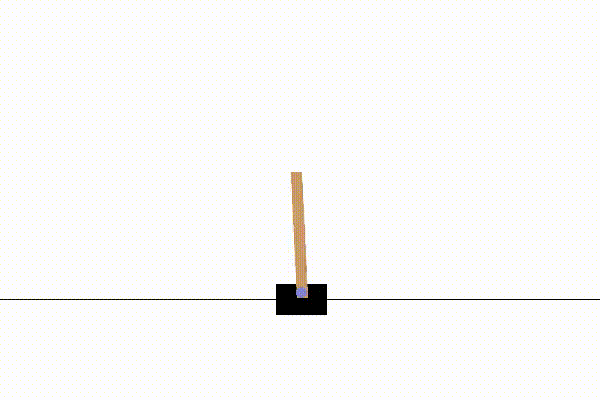
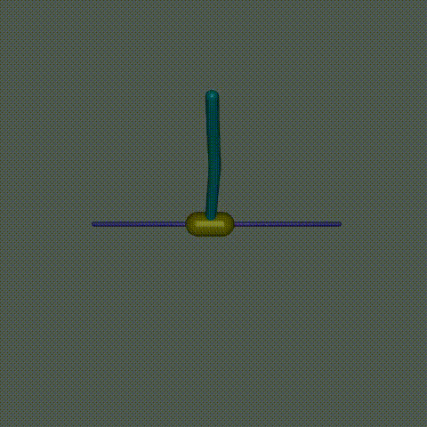
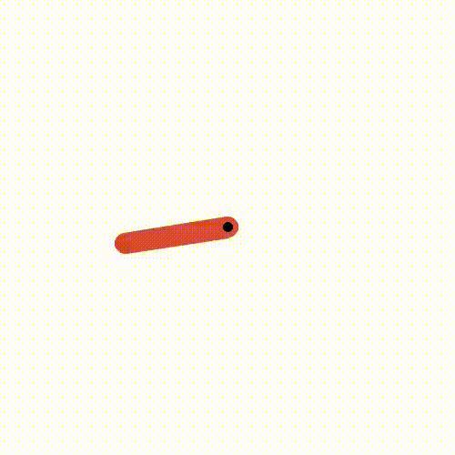
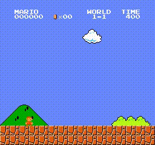
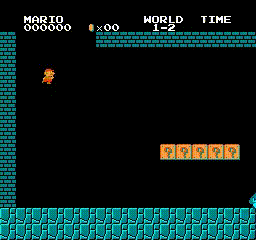
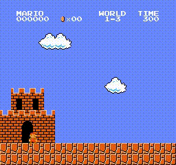
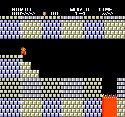

# Introduction

This is a project about ppo demos using [TorchRL](https://pytorch.org/rl/) (Reinforcement Learning library for PyTorch).

#### Demo on CartPole

#### Demo on InvertedDoublePendulum

#### Demo on Pendulum

#### Demo on Super-Mario-Bros

